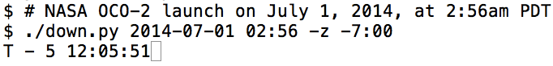

==================================================
README for a simple text-based countdown in Python
==================================================

Problem: You want to count down to an event (e.g., a rocket launch).
But the web-based animated countdown consumes too much screen space
and battery power (i.e., your laptop's fan turns on when you go to that
web page).

Solution: a text-based countdown in a small shell or console window.
This one, ``down.py``, is written in Python 3.
Rather than writing a newline each time, this script rewrites the same line.

Help
====

Here's what you get when you ask for help (``./down.py -h``)::

    Usage: down.py [options] yyyy-dd-mm hh:mm

    Options:
      -h, --help            show this help message and exit
      -z ZONE, --zone=ZONE  timezone as [-]hh:mm
      -c COUNT, --count=COUNT
                            number of iterations
      -i INTERVAL, --interval=INTERVAL
                            seconds between timesteps
      -n, --now             show current time

The output is of the form::

    T - 3 02:35:25

showing the days, hours, minutes, and seconds until the event.

Limitations
===========

The script won't count up for events in the past.

The default count (number of iterations) is 999999999, which taken at
1-second intervals is about 31.6 years.

Examples
========

Launch at 2015-01-01 00:00:00 GMT ::

    ./down.py 2015-01-01 00:00:00

Launch at midnight, June 24, 2014, California time (UTC-7, PDT) ::

    ./down.py 2014-06-24 00:00:00 -z -7:00

Launch at 5:35pm, June 26, 2014, Eastern Daylight Time (UTC-4), report at 5 second
intervals ::

    ./down.py 2014-06-26 00:00:00 -z -4:00

Same as above, but show the current time in UTC. ::

    ./down.py 2014-06-26 00:00:00 -z -4:00 -n

Same as above, but only increment every 5 seconds (and don't show UTC time).

    ./down.py 2014-06-26 00:00:00 -z -4:00 -i 5

